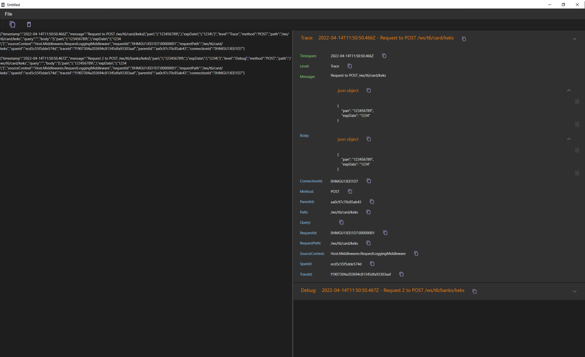

LogParser
=========

Tool for vew pretty logs. Just copy and Paste!



## Features

* Works with command line parameter which is text file with logs

## Docker and Kibana logs.

There are three types of log in the system - Docker, Kibana and Csv.

- Example of Kibana log (LogParser parses only `_source` or `_source`.`fullMessage` (can be switched on in code) object):

```json
{
    "took" : 1073,
    "timed_out" : false,
    "_shards" : {
        "total" : 13,
        "successful" : 13,
        "skipped" : 0,
        "failed" : 0
    },
    "hits" : {
        "total" : {
            "value" : 42,
            "relation" : "eq"
        },
        "max_score" : 0.0,
        "hits" : [
            {
                "_index" : "filebeat-2022.06.23",
                "_type" : "_doc",
                "_id" : "5ifNj4EB-fw2kdSFBGZD",
                "_score" : 0.0,
                "_source" : {
                    "fullMessage" : """{ ... }""",
                    "TraceId" : "9fde11e047ace615822c5417d02843f7"
                },
                "sort" : [
                    1657601105052
                ]
            },
            {
                "_index" : "filebeat-2022.06.23",
                "_type" : "_doc",
                "_id" : "DifNj4EB-fw2kdSFBGdD",
                "_score" : 0.0,
                "_source" : {
                    "fullMessage" : """{ ... }""",
                    "TraceId" : "9fde11e047ace615822c5417d02843f7"
                },
                "sort" : [
                    1657601105052
                ]
            }
        ]
    }
}
```

- Example Docker log:

```json
// any json (will be TechLog) or plain string (will be TextLog)
```

- Example of Csv log:

```csv
"@timestamp",message,"container.name"
"Aug 30, 2023 @ 08:54:39.342","{""timestamp"":""2023-08-30T08:54:39.342Z""}","PMP_DMZ_tsm_accessgate.1.lkuzbn9efs73p9gefzhbtxi2n"
```